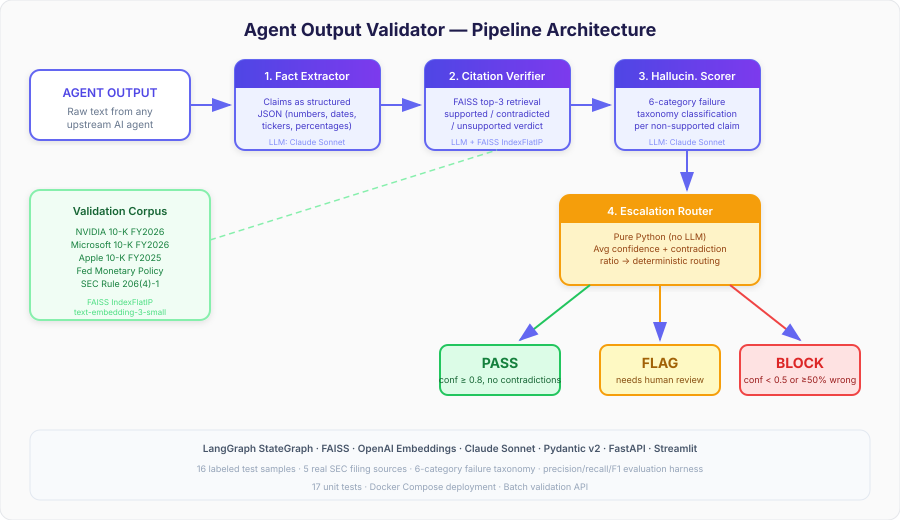

# Agent Output Validator

A multi-agent swarm that validates AI agent outputs for hallucinations, unsupported claims, and factual errors — built with LangGraph, FAISS, and real SEC filing data.

## Why This Exists

Enterprise AI agent platforms deploy dozens of agents that generate financial analyses, compliance summaries, and market reports. But **none of them validate what other agents say.** A hallucinated revenue number in a client-facing report is a compliance violation.

This project fills that gap: a 4-agent validation swarm that catches errors before they reach clients.

## Architecture

<p align="center">
  
</p>

## How It Works

```
Agent Output → Fact Extractor → Citation Verifier → Hallucination Scorer → Escalation Router → Report
```

| Agent | Role |
|-------|------|
| **Fact Extractor** | Pulls every verifiable claim (numbers, dates, tickers, percentages) as structured JSON |
| **Citation Verifier** | Retrieves source documents from FAISS, judges each claim as supported/contradicted/unsupported |
| **Hallucination Scorer** | Classifies failures into a 6-category taxonomy (fabricated fact, incorrect number, misattribution, temporal error, unsupported inference, contradicted by source) |
| **Escalation Router** | Computes confidence scores, decides PASS / FLAG / BLOCK |

### Failure Taxonomy

| Category | Description |
|----------|-------------|
| `fabricated_fact` | Claim has no basis in any source |
| `incorrect_number` | A numeric value is wrong |
| `misattribution` | Fact attributed to wrong entity/person |
| `temporal_error` | Dates or time periods are wrong |
| `unsupported_inference` | Conclusion not supported by data |
| `contradicted_by_source` | Claim directly contradicts source |

## Real-World Data

The validation corpus contains **real SEC filings and public financial data**:

- NVIDIA 10-K FY2026 (filed Feb 25, 2026)
- Microsoft 10-K FY2026 (filed Jul 29, 2026)
- Apple 10-K FY2025 (filed Oct 31, 2025)
- Federal Reserve monetary policy data (FRED)
- SEC Marketing Rule 206(4)-1

16 sample agent outputs test the pipeline against this data — 7 fully correct, 7 with specific wrong numbers, and 2 heavily fabricated. Includes cross-company comparison edge cases.

## Setup

```bash
git clone https://github.com/ventikaa/agent-output-validator.git
cd agent-output-validator
python -m venv .venv && source .venv/bin/activate
pip install -e ".[dev]"
cp .env.example .env  # Add your API keys
```

**Required API keys** (in `.env`):
- `ANTHROPIC_API_KEY` — Claude Sonnet for all 4 agents
- `OPENAI_API_KEY` — text-embedding-3-small for FAISS indexing

## Usage

### CLI

```bash
# Validate a single sample
python run.py nvidia-correct-001

# Validate all 16 samples
python run.py
```

### FastAPI

```bash
uvicorn src.api.server:app --port 8000
```

Then `POST /validate`:
```json
{
  "id": "custom-001",
  "agent_name": "EarningsAgent",
  "content": "NVIDIA reported Q4 FY2026 revenue of $68.127 billion..."
}
```

Endpoints:
- `POST /validate` — single validation
- `POST /validate/batch` — batch mode with aggregate stats
- `GET /samples` — list test cases
- `GET /docs` — Swagger UI

### Streamlit Dashboard

```bash
streamlit run src/ui/dashboard.py
```

Three tabs:
- **Single Validation** — paste any agent output, see claim-by-claim analysis
- **Batch Mode** — upload JSON, get aggregate pass/flag/block rates
- **Sample Gallery** — browse pre-built test cases with expected verdicts

### Docker

```bash
docker compose up
```
- API at `http://localhost:8000`
- Dashboard at `http://localhost:8501`

## Example Output

```
Validating: nvidia-hallucinated-001 (EarningsAgent)
  Overall Confidence: 42%
  Escalation: BLOCK
  Claims: 5 total | 1 supported | 3 contradicted | 1 unsupported
  Failure types: {'incorrect_number': 3, 'fabricated_fact': 1}
    ✓ [95%] Q4 FY2026 revenue reached $68.127 billion
    ✗ [15%] Data Center segment generated $58.1 billion [incorrect_number]
      → Source says Data Center was $62.3 billion, not $58.1 billion
    ✗ [18%] Gaming revenue was $4.2 billion [incorrect_number]
      → Source says Gaming was $3.7 billion, not $4.2 billion
    ✗ [12%] Gross margin improved to 78.3% [incorrect_number]
      → Source says gross margin was 75.0%, not 78.3%
    ✗ [20%] 48,000 people across 42 countries [fabricated_fact]
      → Source says 42,000 employees across 38 countries
```

## Tech Stack

- **Orchestration:** LangGraph (StateGraph with sequential pipeline)
- **LLMs:** Claude Sonnet / GPT-4o (configurable)
- **Retrieval:** FAISS IndexFlatIP with OpenAI text-embedding-3-small
- **API:** FastAPI
- **UI:** Streamlit
- **Data models:** Pydantic v2
- **Testing:** pytest

## Evaluation

Run the full evaluation harness to measure detection accuracy against labeled samples:

```bash
python evaluate.py
```

Outputs precision, recall, F1, escalation accuracy, and per-sample results to `data/evaluation_results.json`.

## Tests

```bash
python -m pytest tests/ -v
```

## Project Structure

```
src/
  agents/
    fact_extractor.py       # Extracts verifiable claims
    citation_verifier.py    # Retrieves sources, judges claims
    hallucination_scorer.py # Classifies failure types
    escalation_router.py    # Confidence scoring, PASS/FLAG/BLOCK
  core/
    schemas.py              # Pydantic models
    indexer.py              # FAISS corpus indexer
    llm.py                  # LLM provider config
    pipeline.py             # LangGraph StateGraph
  api/
    server.py               # FastAPI endpoints
  ui/
    dashboard.py            # Streamlit dashboard
data/
  corpus/                   # Real SEC filings + financial data
  samples/                  # 16 labeled test agent outputs
tests/                      # pytest suite
evaluate.py                 # Precision/recall/F1 evaluation harness
```

## Gap Analysis

This project addresses a critical gap in enterprise AI agent platforms: **output validation.** Most platforms focus on building agents that generate content but have no mechanism to verify what agents produce. In regulated industries like capital markets, an unvalidated hallucination in a client report can trigger compliance violations, fines, and reputational damage.

The 6-category failure taxonomy was developed during production LLM evaluation work across GPT, Claude, Llama 2, and Mistral model families, testing adversarial prompting pipelines and human-in-the-loop validation workflows.
